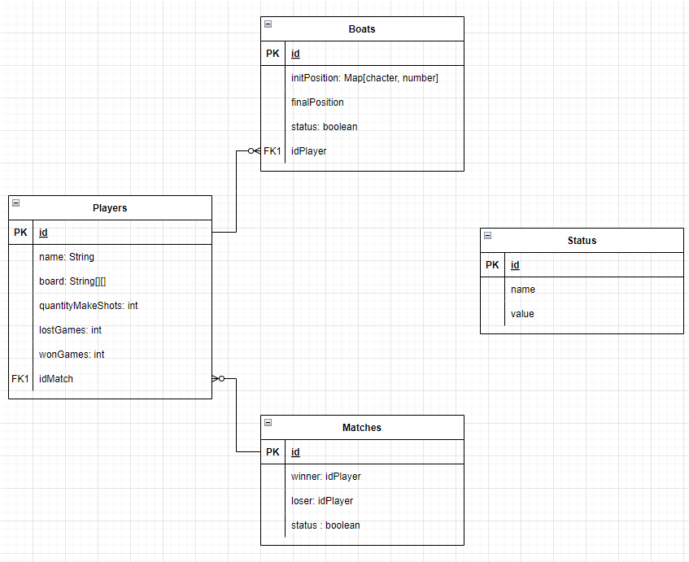

# Diseño API hundir la flota

## Recursos

### Jugadores
#### Atributos


### Partidas
#### Atributos


### Barcos
#### Atributos
- Posición inicial
- Posición final

## Relación entre recursos




## Endpoints

### GET

#### Players

| Método HTTP  | URI | Body | Respuesta | 
| ------------- | ------------- | ------------- | ------------- | 
| GET  | /players  | N/A | 200 OK, 404 NF |
| GET  | /players/{idPlayer}/boats  | N/A | 200 OK, 404 NF |
| POST  | /players  | N/A | 201 Created, 500 ISE |
| DELETE  | /players  | N/A | 204 No Content, 404 NF, 500 ISE |

#### Boats

| Método HTTP  | URI | Body | Respuesta | 
| ------------- | ------------- | ------------- | ------------- | 
| GET  | /boats  | N/A | 200 OK, 404 NF |
| POST  | /boats/{idPlayer}  | RQ1 | 201 Created, 500 ISE |
| DELETE  | /boats/{idBoat}  | N/A | 204 No Content, 404 NF, 500 ISE |

RQ1
```json
{
    "initPosition": [[1,1]],
    "finalPosition":  [[1,1]]
}
```

#### Matches 

| Método HTTP  | URI | Body | Respuesta | 
| ------------- | ------------- | ------------- | ------------- | 
| GET  | /matches/{idMatch}  | N/A | 200 OK, 404 NF |
| POST  | /matches  | RQ2 | 201 Created, 500 ISE |
| PUT  | /matches/{IdMatch}  | RQ2 | 204 No Content, 404 NF 500 ISE |
| PUT  | /matches/{IdMatch}  | N/A | 204 No Content, 404 NF 500 ISE |
| DELETE  | /matches/{idMatch}/{status}  | N/A | 204 No Content, 404 NF, 500 ISE |

RQ2
```json
{
    "idPlayerOne": 1,
    "idPlayerTwo":  2
}
```
